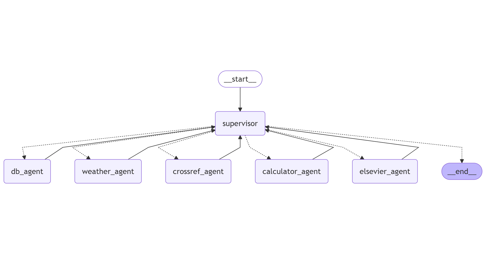

.. _overview:

Project Overview
================

This page provides a high-level overview of the project, including its goals, the technologies used, the internal architecture, and a representative use-case scenario.

Project Description
-------------------

This project investigates the integration of **Large Language Models (LLMs)** into an agent-based system capable of performing complex reasoning across various domains. The architecture is modular, explainable, and designed to combine autonomous language understanding with external tool access and iteration over structured workflows.

### Key components and technologies:
- **LangGraph** and **LangChain** for graph-based agent orchestration.
- **Vertex AI (Gemini Pro)** as the main inference engine.
- **Open-Meteo API** for historical and forecasted weather data.
- **Elsevier API** and **Crossref API** for retrieving scientific literature.
- **InfluxDB** for querying time-series sensor data from laboratories.
- **Custom agents** for handling tasks such as weather retrieval, database access, scientific search, and numerical calculations.
- **Supervisor agent** for iteratively coordinating agent calls and ensuring task completeness.
- **Sphinx** and **ReadTheDocs** for documentation generation and deployment.

Data Flow Architecture
----------------------

The system accepts a complex user query in natural language. A **Supervisor** component processes the query and dynamically routes it through a graph of specialized agents. Each agent performs a well-defined sub-task, such as retrieving sensor data, calculating averages, or searching for scientific models.

The execution graph enables iterative and conditional decision-making: if more information is required, the supervisor can invoke additional agents or reprocess previous results. Once all necessary steps have been completed, the system synthesizes the outputs and delivers a final, explainable response.

The following diagram illustrates the overall architecture and agent interaction:

Example Scenario
----------------

> *"Estimate the heat generation produced by users in Laboratory A from the 5th to 9th of December 2024. Use the temperature difference between indoor sensors and the outdoor temperature in Madrid. Since no occupancy data is available, assume working hours between 08:00 and 18:00 on weekdays. Then search for scientific models of heat generation. Extract the most recent model’s formulation and compare it with your method."*

This prompt triggers the following system behavior:
- The **Supervisor** identifies the need to retrieve both indoor and outdoor temperature data.
- The **DBAgent** collects indoor sensor data from **InfluxDB** within the specified date and time range.
- The **WeatherAgent** fetches outdoor temperature data from **Open-Meteo**.
- The **CalculatorAgent** computes the differential heat profile and estimates human heat generation using known physical assumptions.
- The **ElsevierAgent** and **CrossrefAgent** search for recent scientific models related to heat generation in indoor environments.
- The system compares the computed values with the extracted scientific formulation and generates a reasoned response with quantitative and qualitative analysis.

This scenario demonstrates the system's capacity to chain multiple agents in a supervised loop, integrate structured data with domain knowledge, and generate results with traceable and explainable logic.

